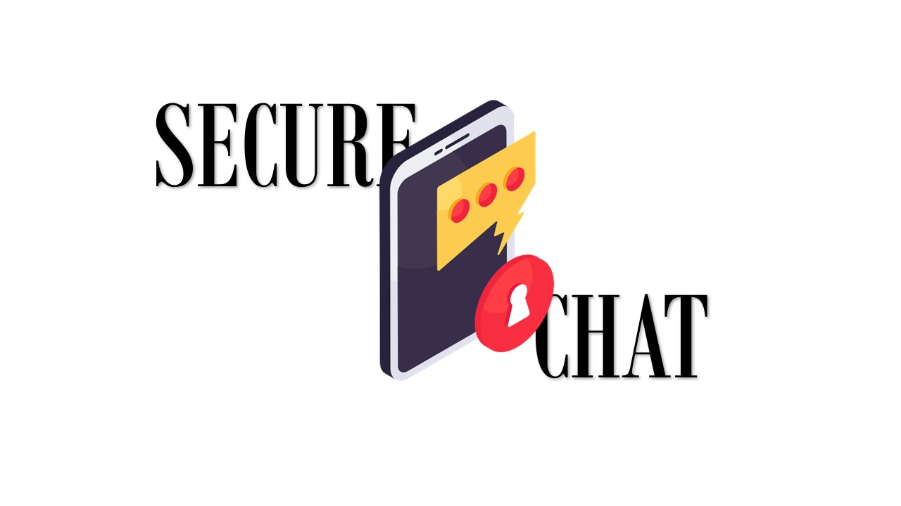

# Secure Chat

Una aplicación de mensajería segura que utiliza cifrado RSA para garantizar la privacidad de las comunicaciones. La aplicación permite a los usuarios intercambiar mensajes cifrados y visualizarlos de manera intuitiva y moderna.

## 📖 Características

- **Cifrado RSA:** Toda la comunicación entre usuarios está protegida con cifrado de clave pública (RSA).
- **Generación y escaneo de QR:** Intercambio rápido de claves públicas mediante códigos QR.
- **Mensajes cifrados:** Opciones para mostrar u ocultar los mensajes cifrados en la interfaz.
- **Interfaz moderna:** Diseño elegante con botones estilizados y una experiencia de usuario intuitiva.
- **Compatibilidad:** Funciona en dispositivos Android.

## 🚀 Instalación

1. Clona este repositorio en tu máquina local:
   ```bash
   git clone https://github.com/MissiegoBeats/secmessaging.git
   ```
2. Abre el proyecto en Android Studio.
3. Descarga e instala las dependencias requeridas en el archivo build.gradle.
4. Asegúrate de habilitar el uso de RenderScript si utilizas el desenfoque de fondo.
5. Ejecutar para instalar en el dispositivo

Nota: En un próximo release, se podrá descargar directamente el .apk file

## 📝 Uso
1. Generación de claves RSA: Al iniciar la aplicación, se generan automáticamente claves pública y privada.
2. Intercambio de claves públicas: Utiliza la funcionalidad de generación y escaneo de códigos QR para intercambiar claves públicas con otros usuarios.
3. Envía y recibe mensajes: Los mensajes se cifran automáticamente usando la clave pública del destinatario. Puedes alternar entre ver los mensajes cifrados o descifrados.
4. Conexión segura: La aplicación establece una conexión segura entre dos dispositivos en la misma red.

## 🔒 Seguridad
1. Cifrado RSA: Cada mensaje se cifra utilizando una clave pública antes de enviarse y solo puede descifrarse con la clave privada correspondiente.
2. Codificación URL: Para garantizar la compatibilidad, los mensajes cifrados se codifican como cadenas URL.

## 📜 Licencia
Este proyecto está bajo la Licencia MIT. Consulta el archivo [LICENSE](LICENSE) para más detalles
